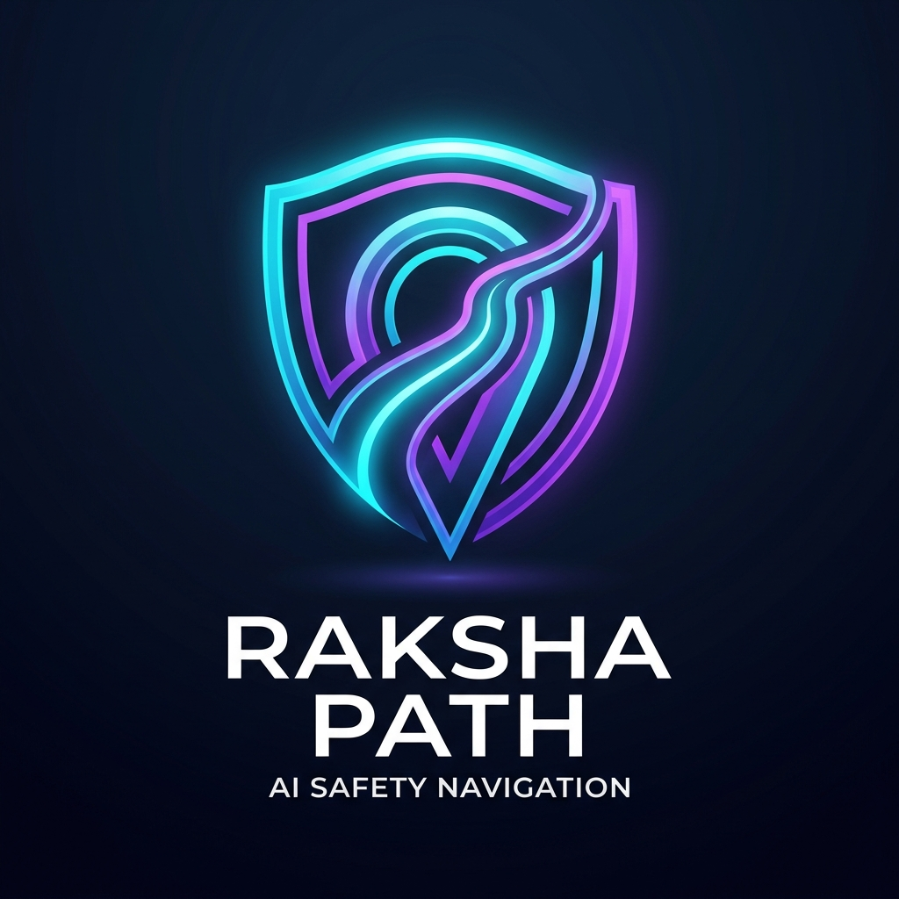

# Raksha Path 🛡️

**"Predict the unseen. Navigate with absolute certainty."**
*Your digital guardian in the physical world.*

Raksha Path is an enterprise-grade AI safety routing engine designed to ensure personal security in urban environments. It synchronizes live threat detection, dynamic hazard analysis, and predictive AI to calculate the absolute safest route for your journey.



## 🌟 Core Features

### 🗺️ AI-Powered Safe Routing (Route Engine)
Instead of just finding the fastest route, Raksha Path finds the *safest* route. 
- Analyzes live traffic incidents via TomTom APIs.
- Predicts isolation risks, crime density, and weather hazards.
- Generates transparent safety audits so you know exactly *why* a route is recommended.

### 🤖 Voice-to-Voice AI Assistant
A truly hands-free Guardian. 
- Integrated Walkie-Talkie mode using `SpeechRecognition` and `SpeechSynthesis`.
- **Multi-Lingual NLP Support:** Automatically detects and speaks in regional rural languages (Hindi, Telugu, Tamil, Marathi) to ensure accessibility for all users.
- Live context awareness using Reverse Geocoding to determine your exact street name and local amenities.

### 🛡️ Guardian Mode
Designed for high-risk situations.
- Real-time GPS tracking shared securely with trusted contacts.
- Instantly discovers nearby Safe Zones (Hospitals, Police Stations, 24/7 Pharmacies) using the Overpass API.
- Automated emergency check-ins and deviation alerts.

### 📊 City Insights & Crowdsourced Reporting
A community-driven safety ecosystem.
- Live threat density heatmaps.
- Anonymous crowdsourced reporting for potholes, harassment, roadblocks, and isolated areas.
- Predictive threat forecasts based on historical and real-time environmental variables.

---

## 🛠️ Technology Stack

### Frontend
- **Framework:** Next.js 14 (App Router)
- **Language:** TypeScript
- **Styling:** Vanilla CSS & TailwindCSS (Glassmorphism UI)
- **Maps:** TomTom Maps Web SDK & Google Maps fallback
- **Icons:** Lucide React

### Backend
- **Framework:** FastAPI (Python)
- **Database:** SQLite / SQLAlchemy
- **AI/LLM Engine:** Groq (Llama 3) & Google Gemini
- **Geocoding & Routing:** TomTom API, OSRM

---

## 🚀 Getting Started

### Prerequisites
- Node.js (v18+)
- Python 3.10+
- API Keys required:
  - `NEXT_PUBLIC_TOMTOM_API_KEY`
  - `GROQ_API_KEY`
  - `GEMINI_API_KEY`
  - `OPENWEATHER_API_KEY`

### Local Development Setup

1. **Clone the repository:**
   ```bash
   git clone https://github.com/yourusername/raksha-path.git
   cd raksha-path
   ```

2. **Start the Backend (FastAPI):**
   ```bash
   cd backend
   pip install -r requirements.txt
   # Setup your .env file with the required API keys
   uvicorn main:app --reload --port 8000
   ```

3. **Start the Frontend (Next.js):**
   ```bash
   cd frontend
   npm install
   # Setup your .env.local file with NEXT_PUBLIC_TOMTOM_API_KEY
   npm run dev
   ```

4. **Access the Application:**
   Open [http://localhost:3000](http://localhost:3000) in your browser.

---

## 📜 License
© 2026 Raksha Path Inc. All rights reserved.

Designed to protect. Built to empower.
